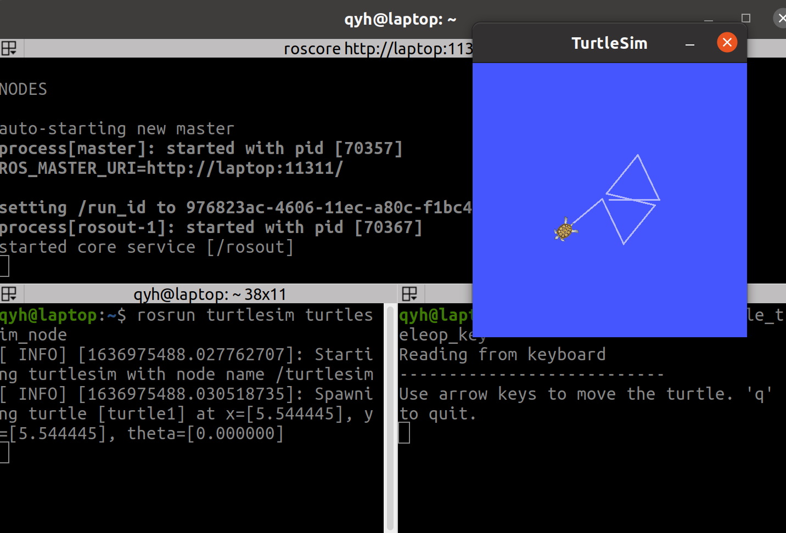
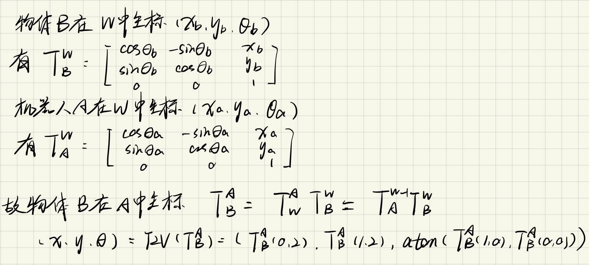
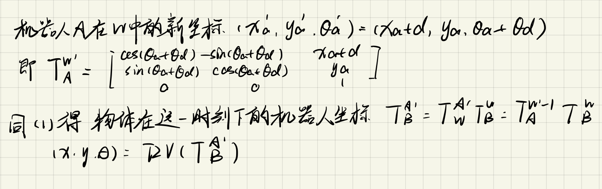
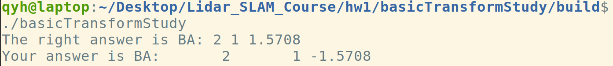

# 激光SLAM课程第一周作业


## 作业1：

### 1. 列举Linux命令

1. ls 列举当前目录下的文件以及文件夹名
2. cd 切换路径
3. mkdir 创建文件夹

### 2. vim基本功能

vim的功能：基于终端的文本编辑器

**插入：**

在命令模式下按 i 在光标处插入；按 I 在行首插入；按A在行尾插入； 按o在下一行插入；按O在上一行插入

**删除：**

常规删除：在输入模式下按backspace删除字符

命令模式下d0 删至行首；D删至行尾；dd删除当前行

底线命令模式:m,nd 删除第m-n行

**保存并退出vim：**

在底线命令模式下：

- q 不保存,直接退出
- q! 不保存，并强制退出
- e! 放弃所有修改，从上次保存文件开始再编辑
- w 保存文件,但不退出
- w! 强制保存，不退出
- wq或x 保存，并退出
- wq! 强制保存，并退出

### 3. Linux压缩解压缩

**基于 `tar`命令的解压缩**

`tar -czvf a.tar.gz a.dat`把 `a.dat`压缩为  `a.tar.gz`

`tar -xzvf a.tar.gz ` 解压 `a.tar.gz`

**基于 `zip`命令的解压缩**

`zip -r test.zip test/`  打包test目录下的文件

`unzip -o test.zip -d dir`  将test.zip解压到dir目录


## 作业2：




## 作业3：

### 1. 



### 2. 




## 作业4：

运行结果：



代码：

```C++
#include <iostream>
#include <Eigen/Core>
#include <Eigen/Geometry>
#include <cmath>

using namespace std;

int main(int argc, char** argv)
{
    // 机器人B在坐标系O中的坐标：
    Eigen::Vector3d B(3, 4, M_PI);

    // 坐标系B到坐标O的转换矩阵：
    Eigen::Matrix3d TOB;
    TOB << cos(B(2)), -sin(B(2)), B(0),
           sin(B(2)),  cos(B(2)), B(1),
              0,          0,        1;

    // 坐标系O到坐标B的转换矩阵:
    Eigen::Matrix3d TBO = TOB.inverse();

    // 机器人A在坐标系O中的坐标：
    Eigen::Vector3d A(1, 3, -M_PI / 2);

    // 求机器人A在机器人B中的坐标：
    Eigen::Vector3d BA;
    // TODO 参照第一课PPT
    
    // start your code here (5~10 lines)
    Eigen::Matrix3d TOA;
    // end your code here
    // 坐标系A到坐标系O的转换
    TOA << cos(A(2)), -sin(A(2)), A(0),
           sin(A(2)), cos(A(2)), A(1),
              0,          0,        1;
    // 坐标系O到坐标系A的转换
    Eigen::Matrix3d TAO = TOA.inverse();
    // 相当与求坐标系A到坐标系B的变换
    Eigen::Matrix3d TBA = TBO*TOA;

    BA << TBA(0,2) , TBA(1,2) ,atan(TBA(1,0)/TBA(0,0));

    cout << "The right answer is BA: 2 1 1.5708" << endl;
    cout << "Your answer is BA: " << BA.transpose() << endl;

    return 0;
}

```

